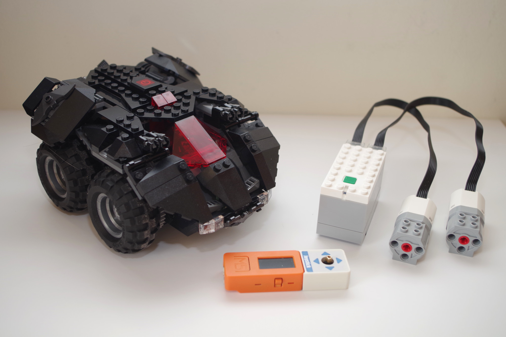
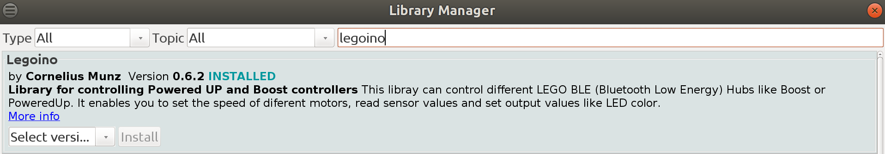

# M5StickC Joystick Lego PoweredUp Batmobile



## Introduction
The Goal of this project is to control your Lego Batmobile (Model 76112) thanks to your M5StickC and its Joystick Hat.

## Donwload
```
git clone https://github.com/colas-sebastien/M5StickC-joystick-lego-powerup-batmobile.git
```

## Software configuration

- Install Arduino IDE and follow the official configuration on [M5Stack site](https://docs.m5stack.com/#/en/arduino/arduino_development)
- Install the Leoino library from the library manager
- Upload the code on your M5StickC

## Play !!!!

## Libraries compatibility issue

Unfortunatly M5StickC and Legoino libraries are not fully compatible because of the color definition. So if you want to use color on your Hub or on your stick I recommend to modify the ```enum``` in the ```Lpf2Hub.h``` file in Legoino library. After you can ucomment lines 48 to 56 in the ino file of the project.

```
typedef enum Color
{
  LEGO_BLACK = 0,
  LEGO_PINK = 1,
  LEGO_PURPLE = 2,
  LEGO_BLUE = 3,
  LEGO_LIGHTBLUE = 4,
  LEGO_CYAN = 5,
  LEGO_GREEN = 6,
  LEGO_YELLOW = 7,
  LEGO_ORANGE = 8,
  LEGO_RED = 9,
  LEGO_WHITE = 10,
  LEGO_NONE = 255
};
```

## Reference
- [The Batmobile on Mecabricks](https://mecabricks.com/en/models/WRaZLqdAjpZ)
- [M5Stack official web site](https://m5stack.com/)
- [Arduino IDE](https://www.arduino.cc/en/Main/Software)
- [M5StickC color issue](https://github.com/m5stack/M5StickC/issues/113)
- [Legoino color issue](https://github.com/corneliusmunz/legoino/issues/15)
